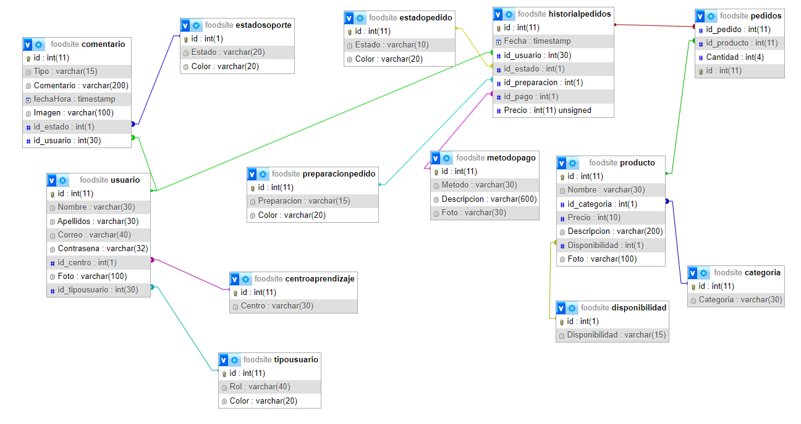

# SENA FOOD SITE
Hi, mi name is **Deibyd** and this is my project to manage clients, vendors, orders and products of a restaurant in an educational institution.
## Prerequisite
You have to install these tools
- [Composer](https://getcomposer.org/)
- [XAMPP](https://www.apachefriends.org/es/index.html)
- [PHP > 8.1.0](https://www.php.net/)
- [NodeJS](https://nodejs.org/en)
- [Git](https://git-scm.com/)

## Features and Functionalities
- As a guest: You can see a list of all products of the restaurant
- As a client: You can do the same as a guest but also you can make orders and manage them, aditionally you're able to manage your profile and report bugs to the administrators.
- As a vendor: You can manage the products, your profile and the orders of all users. You can report bugs also.
- As a administrator: You can manage products, users and bug reports.

## Tech Stack
- [MySQL](https://www.mysql.com/)
- [Laravel 9](https://laravel.com/)
- [Bootstrap](https://getbootstrap.com/)
- [Apache](https://httpd.apache.org/)
- [PHP](https://www.php.net/)

## Data model

## Installation and running

**1. Clone this repo by running the following commands**

`git clone https://github.com/DeibydBarragan/sena-food-site.git`

**2. Then, go to the root folder and run the following to create a .env file**

`cd sena-food-site`

`copy .env.example .env`

**3. Configure the .env file in with these values or with your own values**

```
DB_CONNECTION=mysql
DB_HOST=127.0.0.1
DB_PORT=3306
DB_DATABASE=foodsite
DB_USERNAME=root
DB_PASSWORD=
```

**4. If you want the app to send emails set these values with sendgrid or mailtrap**

```
MAIL_MAILER=smtp
MAIL_HOST={YOUR HOST}
MAIL_PORT={YOUR PORT}
MAIL_USERNAME={YOUR USERNAME}
MAIL_PASSWORD={YOUR PASSWORD}
MAIL_ENCRYPTION=null
MAIL_FROM_ADDRESS="hello@example.com"
MAIL_FROM_NAME="${APP_NAME}"
```

**5. Create a MySql database and run the foodsite.sql that is in the root folder to create example data (remember to name the database the same as in the .env file)**

**6. Install the dependencies**

`composer install`

`npm install`

**7. Then, run the following commands**

`php artisan key:generate`

`php artisan cache:clear`

`php artisan config:clear`

`php artisan storage:link`

**8. Finally, run the following**

`php artisan serve`

now you can use the app in http://localhost:8000

## Build and run the app with Docker
To execute the app (with the MySQL database, and a NGINX server) in a docker container:

1. Make sure you have docker installed on your system
2. If you runned `php artisan storage:link` go to the **public** folder and delete the storage file
3. Configure the .env file with these values
   ```
   **3. Configure the .env file in with these values or with your own values**

```
    DB_CONNECTION=mysql
    DB_HOST=db
    DB_PORT=3306
    DB_DATABASE=foodsite
    DB_USERNAME=homestead
    DB_PASSWORD=secret

```
4. Open the root directory in the terminal and run the following

   ```shell
   docker-compose build
5. Then execute the following command
   
   ```shell
   docker-compose up -d

6. Then run the following commands:

`docker-compose exec app composer install`

`docker-compose exec app php artisan key:generate`

`docker-compose exec app php artisan cache:clear`

`docker-compose exec app php artisan config:clear`

`docker-compose exec app php artisan storage:link`

7. Go to http://localhost:8080 and run the foodsite.sql that is in the root folder in the foodsite database to create example data

Now you can use the app in http://localhost:80

## Example videos

### As a guest

### As a client

### As a vendor
You can use these credentials:

email: vendor@vendor.foodsite
password: 123

### As an administrator
You can use these credentials:

email: admin@admin.foodsite
password: 123
